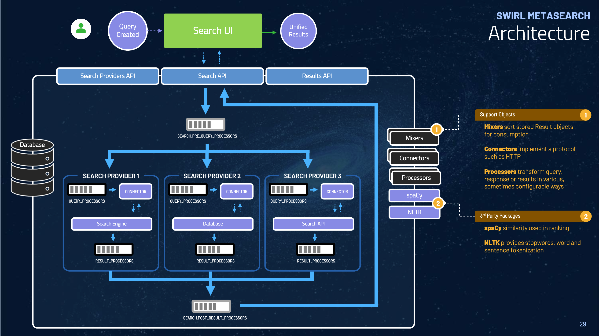
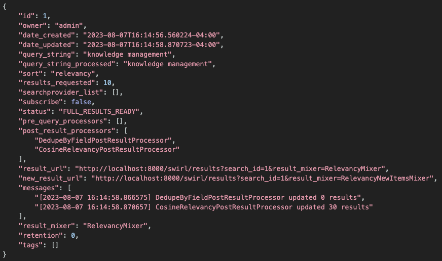
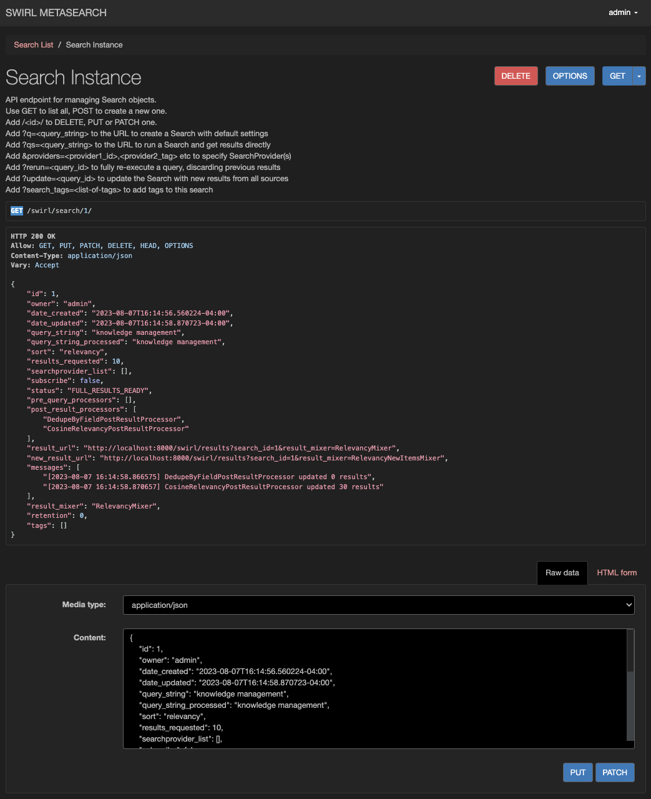
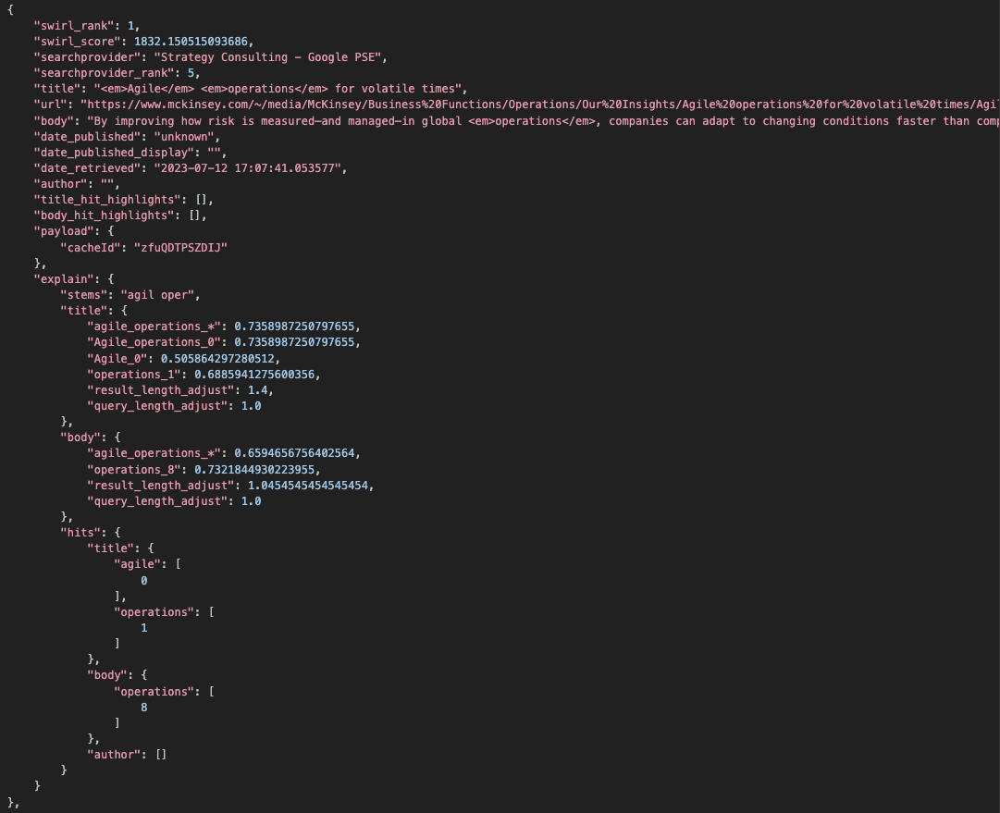
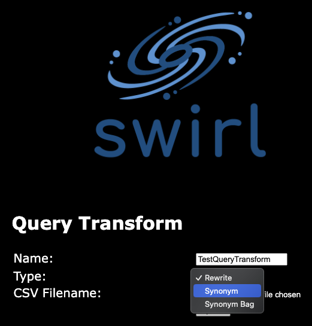
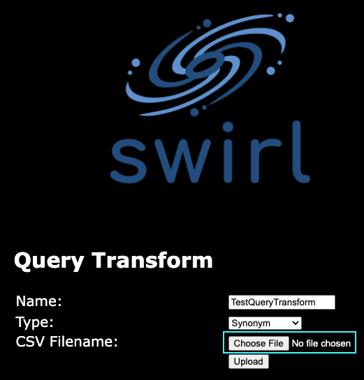
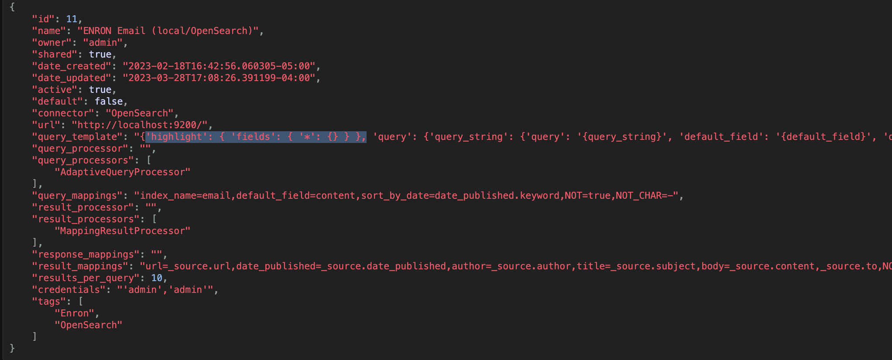
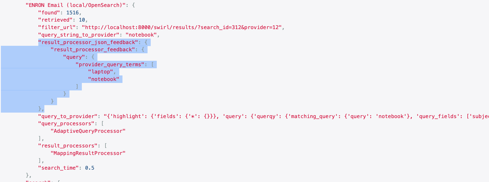

# Introduction

This guide is intended to provide developers with an overview of Swirl and how to accomplish specific tasks with it. Please refer to the [Developer Reference](6.-Developer-Reference) for lists of system states, system objects and properties, etc.

<br/>

# Terminology

| Word | Explanation | 
| ---- | ------- |
| SearchProvider | An object defining some searchable source. It includes metadata identifying the type of connector used to search the source and more. |
| Search | An object defining a query that some user or system desires to have run. It includes the `query_string` with the actual text, and metadata. Most of the metadata is optional.|
| Query | Search engines make a distinction between the act of searching and what goes into a search. The user's keywords or other search terms are usually referred to as a query. Swirl follows this convention whenever possible, but, at times, may refer to a search as a query. Sorry about that. |
| Subscribe | An important property of Search objects. When set to `true`, Swirl will periodically re-run the search, specifying a date sort to get newer data, and removing duplicates from results.|
| Connector | A Swirl module that can connect to, and query, a particular type of data source. Connectors are a wrapper around some existing Python package such as `request.get` or `elasticsearch`.|
| Processors | A Swirl module that can process search (query) or result content in a source-specific or generic format. They transform whatever they accept in various ways - for example removing control characters from a search, or spell checking it, re-mapping source provider result formats to Swirl's own - and more. |
| Pipelines | A process that executes pre-defined sequences of Processors. Each processor transforms whatever content it is asked to operate on. |
| Result | An object defining results from one `SearchProvider` during the federated search process in response to the creation of a `Search` object. It includes metadata about the `SearchProvider`. Much of the metadata is optional.|
| Mixer | A Swirl module that organizes results from multiple `SearchProviders` into a unified result set. It includes metadata from all `SearchProviders` as well as the Search itself.| 
| Relevancy Ranking | An estimation of the relative value of a given search engine result to the user's query, as compared to all others - to put it simply. For more information: [https://en.wikipedia.org/wiki/Relevance_(information_retrieval)](https://en.wikipedia.org/wiki/Relevance_(information_retrieval)) | 

<br/>

# Architecture





# Workflow

1. Create a new `Search` object at the endpoint `/swirl/search/`

    * This invokes the create method in [swirl/views.py](https://github.com/swirlai/swirl-search/blob/main/swirl/views.py). 

    * Swirl responds with the `id` of the newly created Search object. The `view.py` module creates the object, then invokes [swirl/search.py](https://github.com/swirlai/swirl-search/blob/main/swirl/search.py) which manages the federation process from there.

2. The search module [swirl/search.py](https://github.com/swirlai/swirl-search/blob/main/swirl/search.py):

    * Executes pre-query processing, using the specified `Search.pre_query_processors`. 

    * Executes the federation process by creating one [federate_task](https://github.com/swirlai/swirl-search/blob/main/swirl/tasks.py) for each SearchProvider specified.

3. Waits for all tasks to report success by polling the Search and Result objects in the database, or the configured `settings.SWIRL_TIMEOUT` is reached.

<br/>

:clock1: While the search module waits...

<br/>

4. Each `federate_task` creates a `Connector` object.

5. Each `Connector` object executes the federation workflow for the specified SearchProvider, as follows:

    * Executes query processing as specified in `Search.query_processors`

    * Constructs and validates the query for the SearchProvider using the `url`, `query_template`, and `query_mappings`

    * Connects to the SearchProvider, sends the query, and gathers the response

    * Normalizes the response into result format - a list of dicts

    * Executes result processing as specified in `Search.result_processors`

    * Saves the results in the database

<br/>

:clock1: When all the Connectors have written results, or `settings.SWIRL_TIMEOUT` is reached:

<br/>

6. `search.py` invokes the specified `Search.post_result_processors`, and they finalize the results, including relevancy ranking and optionally duplicate detection. 

7. `search.py` sets the `Search.status` to `FULL_RESULTS_READY` or `PARTIAL_RESULTS_READY`

<br/>

:clock1: Anytime after this...

<br/>

8. To retrieve results go to the `Results` endpoint `/swirl/results`

    * All the `Result` objects will appear. Individual ones can be retrieved by adding the `id` to the Result URL. 

    * Adding `search_id` to the Result URL invokes the `Search.result_mixer`. Mixers read the `Result` objects from a single Search, (which are linked by `search_id`), and organize them as appropriate.

9. To continuously update results, set the `Search.subscribe` property to `true`.

    * Swirl will periodically run each `Search` with `Search.subscribe`, setting `Search.sort` to `date`, merging and de-duplicating new results. 

    * New result items can be retrieved by using the `Search.new_results_url` or selecting a `NewItem` mixer.

<br/>

# How To...

## Work with JSON Endpoints

 If using a browser with Swirl API endpoints, including the URLs in this guide, we recommend turning off any browser prefetch, to avoid creating multiple objects using Swirl's `?q=` and `?qs=` parameters. 

* [Turn off Chrome prediction service](https://www.ghacks.net/2019/04/23/missing-chromes-use-a-prediction-service-setting/)
* [Turn off Safari prefetch](https://stackoverflow.com/questions/29214246/how-to-turn-off-safaris-prefetch-feature)

## Create a Search Object with the API

1. Go to http://localhost:8000/swirl/search/


2. Go to the form at the bottom of the page
3. Change the form to "Raw data" mode and clear any pre-built input
4. Copy/paste an example from above
5. Press the POST button

Swirl will respond with the newly created Search Object, including the `id` for it:



Important: Note the `id` value down. It's required in the next step to get unified, relevancy ranked results.

## Create a Search Object with the "q=" URL Parameter

To create a Search object and specify only a `query_string`, accepting the defaults otherwise, add `?q=your-query-string` to the API URL.

For example: [http://localhost:8000/swirl/search?q=knowledge+management](http://localhost:8000/swirl/search?q=knowledge+management])

:stopwatch: Swirl will not respond immediately when you request this URL - be patient!

After a few seconds, Swirl will redirect you to the fully mixed results page:


:key: There are some limitations to the `q=` interface:

* You must URL encode your query; for text queries, this mostly means turning spaces into plus-signs. Use a free URL encoder for help with this: https://www.freeformatter.com/url-encoder.html 
* All active SearchProviders are queried
* Error handling is limited; if no results appear check the Search object by opening: `http://localhost:8000/swirl/search/<your-search-id>`

## Specify SearchProviders with the "providers=" URL Parameter

As of version 1.6, the `providers=` URL parameter is now supported. It accepts a list of SearchProvider Tags, or just a single one. For example:

```
http://localhost:8000/swirl/search/?q=knowledge+management&providers=maritime
```

To specify a list of Tags:

```
http://localhost:8000/swirl/search/?q=knowledge+management&providers=maritime,news
```

## Get synchronous results with the "qs=" URL Parameter

The `qs=` parameter works like the `q=` parameter (*see above*) does, except that it returns the first page of results (only) to the caller directly, with no polling of the Search object or handling of a redirect required.

For example: [http://localhost:8000/swirl/search?qs=knowledge+management](http://localhost:8000/swirl/search?qs=knowledge+management)

The `qs=` parameter can also be used with the [providers](#specify-searchproviders-with-the-providers-url-parameter) and [result_mixer](6.-Developer-Reference/#mixers-1) parameters.

Note that `&page=` is NOT supported with `qs=`; to access the second page of results use the `next_page` property from the `info.results` structure.

```
"results": {
            "retrieved_total": 30,
            "retrieved": 10,
            "federation_time": 2.2,
            "result_blocks": [
                "ai_summary"
            ],
            "next_page": "http://localhost:8000/swirl/results/?search_id=2&page=2"
        }
```

## Request date-sorted results from one or more SearchProviders

If `"sort": "date"` is specified in the Search object, Swirl connectors that support date sorting will request results in that order. By default Swirl will still relevancy rank these results, presenting a cross section of the freshest results from all providers.


Notes:
* In Release 2.5, the `DateFindingResultProcessor` was added to the Google PSE SearchProvider JSON. It finds a date in a large percentage of results that otherwise wouldn't have one, and copies the date to the `date_published` field.
* Some sources simply won't report a date published, but still send a different response.

## Handle NOTted queries

Should a SearchProvider include a NOT'ted term in a result, a message is placed in the [Relevancy Explain](#understand-the-explain-structure). For example, here is an example result for the query `generative ai NOT chatgpt` which returned the term `chatgpt` anyway, failing to honor the NOT:


One way to address this is to make sure the [NOT query-mapping](2.-User-Guide#query-mappings) is set correctly for that provider.

## Subscribe to a Search

Search objects have a `subscribe` property. If set to `true`, Swirl will [update the Search](#update-a-search) every four hours, setting the `sort` property to `date` in order to favor new results.

For example:

```
{
    "id": 10,
    "owner": "admin",
    "date_created": "2023-08-07T16:51:41.391574-04:00",
    "date_updated": "2023-08-07T16:52:49.395218-04:00",
    "query_string": "electric vehicles NOT tesla",
    "query_string_processed": "electric vehicles NOT tesla",
    "sort": "relevancy",
    "results_requested": 10,
    "searchprovider_list": [],
    "subscribe": true,
    "status": "FULL_RESULTS_READY",
    "pre_query_processors": [],
    "post_result_processors": [
        "DedupeByFieldPostResultProcessor",
        "CosineRelevancyPostResultProcessor"
    ],
    "result_url": "http://localhost:8000/swirl/results?search_id=10&result_mixer=RelevancyMixer",
    "new_result_url": "http://localhost:8000/swirl/results?search_id=10&result_mixer=RelevancyNewItemsMixer",
    "messages": [
        "[2023-08-07 16:51:43.648034] DedupeByFieldPostResultProcessor updated 0 results",
        "[2023-08-07 16:51:43.651454] CosineRelevancyPostResultProcessor updated 30 results"
    ],
    "result_mixer": "RelevancyMixer",
    "retention": 0,
    "tags": []
}
```

The `post_result_processors` specification above includes [detecting and removing duplicates](#detect-and-remove-duplicate-results) by exact match on a specified field. 

Swirl will set the `status` to "FULL_UPDATE_READY" when finished updating. New results will have a field `new` which will be set to 1. Use the `new_result_url` to retrieve new results via the `ResultNewItemsMixer` or `DateNewItemsMixer`, depending on the `sort` specified.

```
{
    "id": 10,
    "owner": "admin",
    "date_created": "2023-08-07T16:51:41.391574-04:00",
    "date_updated": "2023-08-07T17:00:02.011144-04:00",
    "query_string": "electric vehicles NOT tesla",
    "query_string_processed": "electric vehicles NOT tesla",
    "sort": "date",
    "results_requested": 10,
    "searchprovider_list": [],
    "subscribe": true,
    "status": "FULL_UPDATE_READY",
    "pre_query_processors": [],
    "post_result_processors": [
        "DedupeByFieldPostResultProcessor",
        "CosineRelevancyPostResultProcessor"
    ],
    "result_url": "http://localhost:8000/swirl/results?search_id=10&result_mixer=RelevancyMixer",
    "new_result_url": "http://localhost:8000/swirl/results?search_id=10&result_mixer=RelevancyNewItemsMixer",
    "messages": [
        "[2023-08-07 16:51:43.648034] DedupeByFieldPostResultProcessor updated 0 results",
        "[2023-08-07 16:51:43.651454] CosineRelevancyPostResultProcessor updated 30 results",
        "[2023-08-07 16:55:02.161868] DedupeByFieldPostResultProcessor deleted 2 results",
        "[2023-08-07 16:55:02.166261] CosineRelevancyPostResultProcessor updated 58 results",
        "[2023-08-07 17:00:02.006126] DedupeByFieldPostResultProcessor deleted 30 results",
        "[2023-08-07 17:00:02.010975] CosineRelevancyPostResultProcessor updated 58 results"
    ],
    "result_mixer": "RelevancyMixer",
    "retention": 0,
    "tags": []
}
```

The `messages` part of the Search object will contain messages from the federation process. The Result objects from each SearchProvider contain `messages` from that source. 

Use the [NewItems Mixers](6.-Developer-Reference/#mixers-1) to view only new results for a Search. 

## Subscribe to a Search with M365 Sources

:warning: To subscribe to a Search that contains any Microsoft SearchProviders, follow these steps _BEFORE_ setting the `subscribe` field to `true` on the Search object.

* Enter this URL into a browser to open the Swirl homepage: http://localhost:8000/swirl/


* Click on `Admin`

* Log in as the user who _owns_ the Search object you want to subscribe

* Return to the Swirl homepage, and then click `Authenticators`

:key: If you don't see the Microsoft option on this page, make sure that at least one M365 SearchProvider enabled (`"active": true`) before proceeding to the next step.

* Click the `Refresh Token` button<br/>


* Log in to your Microsoft account, if prompted to do so

* Return to the Swirl Search object and set `"subscribe": true` on that Search

## Detect and Remove Duplicate Results

Swirl includes two `PostResultProcessors` that can detect and remove duplicates.

| Processor | Description | Notes |
|-----------|-------------|-------|
| DedupeByFieldResultProcessor | Detects duplicates by identical match on a single field, and deletes them | The field is specified in [swirl_server/settings.py](https://github.com/swirlai/swirl-search/blob/main/swirl_server/settings.py) and the default field is `url` |
| DedupeBySimilarityResultProcessor | Detects duplicates by similarity threshold, and deletes them | The similarity considers the `title` and `body` fields, and the threshold is set in [swirl_server/settings.py](https://github.com/swirlai/swirl-search/blob/main/swirl_server/settings.py) |

The `DedupeByFieldResultProcessor` in included in the default `Search.post_result_processors` pipeline. To change this modify the `getSearchPostResultProcessorsDefault` method in [swirl/models.py](https://github.com/swirlai/swirl-search/blob/main/swirl/models.py). 

## Manage Search Objects

You can edit any Search by adding the `id` to the end of the /swirl/search URL. For example: http://localhost:8000/swirl/search/1/



From here, you can use the form to:

* DELETE it, forever
* Edit the body of the request and PUT it back

If you delete a Search, the associated Result objects are immediately deleted as well. This may be changed in a future release.

## Re-Run a Search

The re-run option is available to handle failed searches, partial results, changes to relevancy, or SearchProvider configuration changes.

| Method | Description | Example URL |
| ------ | ----------- | ----------- |
| Re-run | Discards any previous results and re-runs the Search | http://localhost:8000/swirl/search?rerun=1 |

This URs is provided by Swirl in every mixed result set, in the `info.search` block of the response.

## Update a Search

To re-run a Search, but add new results to the previous ones, run an update:

```
http://localhost:8000/swirl/search/?update=<search-id>
```

The update will change the `Search.sort` to "date" prior to running, to favor new results. Swirl will also de-duplicate results using the `url` field, by default. As the update proceeds, Swirl will update the Search and Result message fields as appropriate, along with the result counts.

Use the [`RelevancyNewItemsMixer` and `DateNewItemsMixer`](6.-Developer-Reference/#mixers-1) to retrieve new, updated results.

## Add Spelling Correction

To specify spelling correction for the `Search.query_string`, add this option to the Search object:

```
    "pre_query_processors": ["SpellcheckQueryProcessor"],
```

Corrections are provided by [TextBlob](https://textblob.readthedocs.io/en/dev/quickstart.html#spelling-correction) which is claimed to be at most ~70% accurate. 

If you want to apply spellcheck to a single SearchProvider, put it in that SearchProvider's `query_processors` property instead. 

:warning: Use Spellcheck cautiously as it tends to cause a lack of results from sources that have sparse indexes and limited or no fuzzy search.

## Expire Search Objects

If your Swirl installation is using the [Search Expiration Service](3.-Admin-Guide#search-expiration-service), users can specify the retention setting for each Search. 

The following table describes the `Search.retention` field:

| Retention Value | Meaning | 
| --------------- | ------- |
| 0 | Retain indefinitely, do not expire |
| 1 | Retain for 1 hour | 
| 2 | Retain for 1 day | 
| 3 | Retain for 1 month |

The exact time of expiration is determined by the [Celery Beat Configuration](3.-Admin-Guide/#configuring-celery--redis) and the [Search Expiration Service](3.-Admin-Guide#search-expiration-service) configuration.

## Manage Results

To delete a result Object - for example if you re-run a Search - add the `id` of the Result to the Result URL. For example: [http://localhost:8000/swirl/results/1/](http://localhost:8000/swirl/results/1/)

From here, you can use the form to:

* DELETE it, forever
* Edit the body of the request and PUT it back

If you delete a Result set, it *will not* delete the associated Search.

## Get Unified Results

Result Mixers organize Result objects from multiple SearchProviders into unified result sets. 

Mixers operate only on saved Results - not live/raw federated data - and can be safely run again and again. The mixed output will immediately reflect any changes in Result data - for example if [re-running a search](#re-run-a-search).

To retrieve the unified results for a Search, add `?search_id=` and the `id` of the Search to the Result API endpoint. For example: [http://localhost:8000/swirl/results?search_id=1](http://localhost:8000/swirl/results?search_id=1)

Swirl will respond with results organized by the `result_mixer` specified in the Search object.


Specify a different Mixer on-the-fly by adding the URL parameter `result_mixer`. For example: [http://localhost:8000/swirl/results?search_id=1&result_mixer=Stack1Mixer](http://localhost:8000/swirl/results?search_id=1&result_mixer=Stack1Mixer)

## Page Through Results

Swirl by default requests at least 10 results per SearchProvider, and stores them in its local SQLite3 database. To page through results, add a page parameter to the Results URL. For example:

For example: [http://localhost:8000/swirl/results?search_id=1&page=2](http://localhost:8000/swirl/results?search_id=1&page=2)

If you need more mixed results, increase the `results_per_query` value in the SearchProviders. A setting of 20 or 50 or 100 
will ensure that you have lots of results to page through with the mixer.

Since Swirl will only page through saved Results, re-run the query with a higher `results_per_query` value in each SearchProvider to get more results.

## Get Search Times

Swirl reports each source's search time in the relevant info block of the response:

```
        "info": "Enterprise Search (web/Google PSE)": {
            "found": 8640,
            "retrieved": 10,
            ...
            "search_time": 2.1
        },
```

The overall search time is reported in the info.results block:

```
        "results": {
            "retrieved_total": 50,
            "retrieved": 10,
            "federation_time": 3.2,
            "next_page": "http://localhost:8000/swirl/results/?search_id=507&page=2"
        }

```

The timings are in seconds, and rounded to the nearest 0.1. 

The federation time includes query, response, connection, querying, response, result and post-result processing time. Mixer time is not included in federation time.

## Configure Pipelines

In Swirl 2.5, result processing was separated into two passes. The `SearchProvider.result_processors` runs first, followed by the `Search.post_result_processors` which adjusts length and finalizes.  Example `result_processors` configuration from a Google PSE SearchProvider:

```
    "result_processors": [
        "MappingResultProcessor",
        "DateFinderResultProcessor",
        "CosineRelevancyResultProcessor"
    ],
```

The default `Search.result_mixer` is the `RelevancyMixer`.

To change these, modify [swirl/models.py](https://github.com/swirlai/swirl-search/blob/main/swirl/models.py) and change the `Search.getSearchPostResultProcessorsDefault()`. 

To change the default mixer, change the default in the `Search.result_mixer`:

```
result_mixer = models.CharField(max_length=200, default='RelevancyMixer', choices=MIXER_CHOICES)
```

## Configure Relevancy Field Weights

To configure the weights for individual Swirl fields, modify the `RELEVANCY_CONFIG` dictionary in the [swirl_server/settings.py](https://github.com/swirlai/swirl-search/blob/main/swirl_server/settings.py) file.

The defaults are:

| Field | Weight | Notes | 
| ----- | ------ | ----- | 
| title | 1.5    | |
| body  | 1.0    | Base relevancy score | 
| author | 1.0   | |

## Configure Stopwords Language

As of version 1.6, Swirl is configured to load English stopwords only. To change this, modify `SWIRL_DEFAULT_QUERY_LANGUAGE` in [swirl_settings/settings.py](https://github.com/swirlai/swirl-search/blob/main/swirl_server/settings.py) and change it to another [NLTK stopword language](https://stackoverflow.com/questions/54573853/nltk-available-languages-for-stopwords).

## Understand the Explain Structure

The [CosineRelevancyProcessor](6.-Developer-Reference/#cosinerelevancypostresultprocessor) outputs a JSON structure that explains the `swirl_score` for each result. It is displayed by default; to hide it add `&explain=False` to any mixer URL.



The following table explains the meaning of each match:

| Postfix | Meaning | Example | 
| ------- | ------- | ------- |
| `_*` | Entire query matched, at least partially, against the entire result field | `"knowledge_management_*", .73323667..` |
| `_s*` | Entire query matched, at least partially, one or more sentences, and this is the maximum similarity |  `"knowledge_management_s*", .73323667..` | 
| `_n` | A part of the query matched at word position `'n'` in the field | `"Knowledge_Management_0", .73323667..` |

For queries that include a match position, the actual match terms are extracted and highlighted.

The structure also includes matching stems (`"stems"`), result and query length adjustments as noted above, and a structure called `"hits"` that identifies the zero-offset token count for each match.

## Develop New Connectors

:warning: To connect to a new endpoint for an existing Connector - like RequestsGet - create a new SearchProvider instead. The [Google PSE SearchProvider example JSON](https://github.com/swirlai/swirl-search/blob/main/SearchProviders/google_pse.json) shows how to use one connector to make hundreds of SearchProviders!

To metasearch against a new API where there is a high quality Python package and/or a unique data transport not already supported - then write a new Connector. 

The base classes are here: [swirl/connectors](https://github.com/swirlai/swirl-search/raw/main/swirl/connectors/). 

Each Connector is responsible for a workflow defined in the base class `federate()` method:

```
    def federate(self):

        '''
        Executes the workflow for a given search and provider
        ''' 
        
        self.start_time = time.time()

        if self.status == 'READY':
            self.status = 'FEDERATING'
            try:
                self.process_query()
                self.construct_query()
                v = self.validate_query()
                if v:
                    self.execute_search()
                    if self.status not in ['FEDERATING', 'READY']:
                        self.error(f"execute_search() failed, status {self.status}")
                    if self.status == 'FEDERATING':
                        self.normalize_response()
                    if self.status not in ['FEDERATING', 'READY']:
                        self.error(f"normalize_response() failed, status {self.status}")
                    else:
                        self.process_results()
                    if self.status == 'READY':
                        res = self.save_results()
                        if res:
                            return True
                        else:
                            return False
                    else:
                        self.error(f"process_results() failed, status {self.status}")
                        return False
                else:
                    self.error(f'validate_query() failed: {v}')
                    return False
                # end if
            except Exception as err:
                self.error(f'{err}')
                return False
            # end try
        else:
            self.error(f'unexpected status: {self.status}')
            return False
        # end if


```

The following table explains each stage executed by each Connector:

<br/>

| Stage | Description | Notes |
| ----- | ----------- | ----- |
| process_query | Calls the specified processor to adapt/transform the query for this SearchProvider | |
| construct_query | Assembles the final form query for the source | |
| validate_query | Attempts to verify that the query should produce results, if there are any, and is free of syntax errors | Returns False if the query_to_provider is not valid |
| execute_search | Connects to the defined SearchProvider, issues the query, and stores the response |  |
| normalize_response | Transforms the SearchProvider response into a JSON result set that Swirl can use |  |
| process_results | Calls the specified processor to transform the JSON results into the Swirl result format |  |
| save_results | Stores the normalized results in the Django database | |

A connector is expected to override `execute_search` and `normalize_response`, at minimum. For more information, review the [Connector base class](https://github.com/swirlai/swirl-search/blob/main/swirl/connectors/connector.py).

The `"eval_credentials": "",` option can be used to set a credential variable in the session and then utilize it in the SearchProvider configuration.  For example, if you set `session['my-connector-token']`, Swirl will take that variable and replace it with the `{credentials}` string in the SearchProvider.

```
{
   ...
   eval_credentials: 'session["my-connector-token"]',
   credentials: 'myusername:{credentials}'
}
```

Notes:

* Import new connectors in [`swirl/connectors/__init__.py`](https://github.com/swirlai/swirl-search/blob/main/swirl/connectors/__init__.py)
* Add new processors to the appropriate CHOICES section of [swirl/models.py](https://github.com/swirlai/swirl-search/tree/main/swirl/models.py) - note this will require [database migration](3.-Admin-Guide#database-migration) 
* Connectors should only import the objects required for a single connection - for example requests, Elastic or SQLite3
* To implement a variation on an existing transport, derive a class from it, then override just the `normalize_response` method.
* Make sure the new `execute_query` method:
    * Supports `results_per_query` > 10, including automatic paging if needed
    * Supports date sorting, if the source repository does
* Develop `query_mappings` including especially `DATE_SORT`, `PAGE`, `NOT_CHAR` and `NOT`
* Results from each source should be processed with a result processor, ideally the [MappingResultProcessor](6.-Developer-Reference/#result-processors).

## Develop New Processors

Processors objects are defined in [swirl/processors](https://github.com/swirlai/swirl-search/raw/main/swirl/processors/). They are designed to be executed in sequence. Each should perform one set of transformations and no more. 

To create a new processor, derive it from `Query`, `Result` or `PostResultProcessor`. Override the `process()` method for simple changes, or derive new ones by adding variables to `__init__`. Be sure to `validate()` them. Processors MUST return either the processed data or, for `PostResultProcessors`, an integer indicating how many results were updated. 

The following table describes the classes available:

| Processor  | Description | Notes |
| ---------- | ----------- | ----- |
| AdaptiveQueryProcessor | Handles query adaptation using `query_mappings` | Default |
| MappingResultProcessor | Prepares results using `result_mappings` | Default |
| CosineRelevancyPostResultProcessor | Performs relevancy ranking of Results | |
| DedupeByFieldPostResultProcessor | Detects and removes duplicates from Results by exact match on a specified field | |
| DedupeBySimilarityPostResultProcessor | Detects and removes duplicates from Results by Cosine Similarity | |
| GenericQueryProcessor | Removes special characters | |
| GenericResultProcessor | Copies response to result by exact field name match (e.g. `title`) | |
| DateFinderResultProcessor | Looks for a date in the `body` field of each result item. Should it find one, and the `date_published` for that item is `'unknown'`, it replaces `date_published` with the date extracted from the body, and notes this in the `result.messages`. |

<br/>

Notes:

* Import new processors in [`swirl/processors/__init__.py`](https://github.com/swirlai/swirl-search/tree/main/swirl/processors/__init__.py)
* Add new processors to the appropriate `CHOICES` part of [swirl/models.py](https://github.com/swirlai/swirl-search/tree/main/swirl/models.py) - note this will require [database migration](3.-Admin-Guide#database-migration) 
* Only `PostResultProcessors` should access model data
* Make sure the `process()` method returns data or a count of the number of results updated
* Helper functions to create Result dictionaries and highlight text are located in [swirl/processors/utils.py](https://github.com/swirlai/swirl-search/tree/main/swirl/processors/utils.py)

## Develop New Mixers

Mixers are located in [swirl/mixers](https://github.com/swirlai/swirl-search/raw/main/swirl/mixers/). They implement the following workflow:

```
    def mix(self):

        '''
        Executes the workflow for a given mixer
        '''

        self.order()
        self.finalize()
        return self.mix_wrapper
```

Most variations on Mixers override the `order()` method. All `order()` has to do is save `self.all_results` in some new order, as `self.mixed_results`. For example:

```
    def order(self):

        '''
        Orders all_results into mixed_results
        Base class, intended to be overriden!
        '''

        self.mixed_results = self.all_results[(self.page-1)*self.results_requested:(self.page)*self.results_requested]

```

Here's the `RelevancyMixer`:

```
class RelevancyMixer(Mixer):

    type = 'RelevancyMixer'

    def order(self):

        # sort by score
        self.mixed_results = sorted(sorted(self.all_results, key=itemgetter('searchprovider_rank')), key=itemgetter('swirl_score'), reverse=True)
```

The `finalize()` method trims the `self.mixed_results` to the appropriate page, adds metadata, and returns the `mix_wrapper` structure. So long as there are enough results, the Mixer will page through them.

Notes:

* Import new mixers in [`swirl/mixers/__init__.py`](https://github.com/swirlai/swirl-search/tree/main/swirl/mixers/__init__.py)
* Add new mixers to the appropriate `CHOICES` section of [`swirl/models.py`](https://github.com/swirlai/swirl-search/tree/main/swirl/models.py) - note this will require [database migration](3.-Admin-Guide#database-migration) 

<br/>

# Using Query Transformations

## Query Transformation Rules
As of Swirl 2.0, developers can apply a set of transformation rules to a query using the new Query Transformation feature.

The rules can be applied for all sources (`pre-query`) or to individual sources (`query`). There are three transformation types:

* Replace - Replace one string in the query w/ another or with nothing, essentially remove the term.
* Synonym - Replace a term with an OR of the original term and the synonyms
* Synonym Bag - Replace a term with an OR of all synonyms

Rules for the three types of supported transformations are expressed in terms of CSVs that are uploaded to Swirl.

### Replace/Rewrite
* Column 1 - A semi-colon separated list of patterns to replace. Limited use of wild cards is supported: non-leading star character.
* Column 2 - String to replace the patterns with.

Note: For the use case of removing a term DO NOT add a comma after the first column, and there can be only 1 term for this usage.

Example configuration:
```
# column1, column2
mobiles; ombile; mo bile, mobile
computers, computer
cheap* smartphones, cheap smartphone
on
```

Example results:
| query | transformation |
| ---------- | ---------- |
| mobiles | mobile |
| ombile | mobile |
| mo bile | mobile |
| on computing | computing |
| cheaper smartphones | cheap smartphone |
| computers go figure | computer go figure |

### Synonym
* Column 1 - Term
* Column 2 - Synonym

Example configuration:
```
# column1, column2
notebook, laptop
laptop, personal computer
pc, personal computer
personal computer, pc
car, ride
```

Example results:
| query | transformation |
| ---------- | ---------- |
| notebook | (notebook OR laptop) |
| pc | (pc OR personal computer) |
| personal computer | (personal computer OR pc) |
| I love my notebook | I love my (notebook OR laptop) |
| This pc, it is better than a notebook	| This (pc OR personal computer) , it is better than a (notebook OR laptop) |
| My favorite song is "You got a fast car" | My favorite song is " You got a fast (car OR ride) " |

### Synonym Bag
* Column 1 - Term
* Column 2..N - List of Synonyms

Example configuration:
```
# column1..columnN
notebook, personal computer, laptop, pc
car,automobile, ride
```

Example results:
| query | transformation |
| ---------- | ---------- |
| car | (car OR automobile OR ride) |
| automobile | (automobile OR car OR ride) |
| ride | (ride OR car OR automobile) |
| pimp my ride	| pimp my (ride OR car OR automobile) |
| automobile, yours is fast | (automobile OR car OR ride) , yours is fast |
| I love the movie The Notebook | I love the movie The Notebook |
| My new notebook is slow | My new (notebook OR personal computer OR laptop OR pc) is slow |

### Uploading a Query Transformation CSV
Go to the Swirl homepage and make sure you're logged in as an `admin` user.

Select the `Upload Query Transform CSV` option:<br/>


Enter a `Name` for the CSV and select a `Type` value:<br/>


Choose the CSV file to upload:<br/>


Select the `Upload` button:<br/>


After this, you can now use the uploaded CSV in pre-query or query processing by referencing it as: `<name>.<type>`

So, for the CSV uploaded above, the reference would be: `TestQueryTransform.synonym`

### Pre-Query Processing

Adding a pre-query processor can be done in one of two ways:

* The `pre_query_processor` parameter can be used when running the search through the REST API.  For example:
```
/api/swirl/search/search?q=notebook&pre_query_processor=TestQueryTransform.synonym
```

* The Swirl Search Object's `pre_query_processors` field can be updated to include the reference to the query transform. See the User Guide for details on [creating a search object with the API](#create-a-search-object-with-the-api): 

### Query Processing

Update the Search Provider's `query_processors` field to include the reference.  For example:
```
{
    "name": "TEST Enterprise Search (web/Google PSE) with qxr query_processor",
    "active": "true",
    "default": "true",
    "connector": "RequestsGet",
    "url": "https://www.googleapis.com/customsearch/v1",
    "query_template": "{url}",
    "query_processors": [
      "AdaptiveQueryProcessor",
      "TestQueryTransform.synonym"
    ],
    "query_mappings": "cx=0c38029ddd002c006,DATE_SORT=sort=date,PAGE=start=RESULT_INDEX,NOT_CHAR=-",
    "response_mappings": "FOUND=searchInformation.totalResults,RETRIEVED=queries.request[0].count,RESULTS=items",
    "result_processors": [
      "MappingResultProcessor",
      "CosineRelevancyResultProcessor"
    ],
    "result_mappings": "url=link,body=htmlSnippet,cacheId,NO_PAYLOAD",
    "results_per_query": 10,
    "credentials": "key=",
    "tags": [
      "News",
      "EnterpriseSearch"
    ]
  }
```
## Integrate Source Synonyms Into Swirl Relevancy

:star: New in Swirl 1.10:  Use hit highlight extraction to integrate a SearchProvider's synonym hits into Swirl's relevancy processing.

Data source synonym configuration can compromise the accuracy of Swirl's relevancy scoring because the relevancy `PostResultProcessor` isn't aware of terms used to retrieve documents that were not part of the original query. As of Release 1.10, Swirl can surface any terms used by the SearchProvider to match documents in the results returned by that source.

The following SearchProviders may be configured with synonym support at the source and require this additional configuration in Swirl:
- OpenSearch
- Elastic
- Solr

### Configuration

1. Update the default SearchProvider configuration to add hit highlighting to the source fields that are mapped to Swirl's `title` and `body` fields.

Exactly how to do this will vary based on the original search engine and the use case, but to enable highlighting on every field, add the following to the `query_template` field of the SearchProvider:

```
'highlight': { 'fields': { '*': {} } },
```



Consult the documentation for the original search engine for other way this could be accomplished.

2. In the `results_mapping` field of the SearchProvider, asssign the Swirl fields `body_hit_highlights` and `title_hit_highlights` to the JSON reference in which the source's hit highlighting resides.

For example, for the following result:

```
       {
        "_source" : {
          "url" : "blair-l/sent_items/605.",
          "date_published" : "2001-08-02 16:08:06.000000",
          "author" : "Blair, Lynn </O=ENRON/OU=NA/CN=RECIPIENTS/CN=LBLAIR>",
          "to" : "Scott, Donna </O=ENRON/OU=NA/CN=RECIPIENTS/CN=Dscott1>",
          "subject" : "Laptop computer",
          "content" : "\t\tDonna, I need one laptop computer for Terry or John to use when they\tare out of town.  Please put them on the list. Thanks. Lynn"
        },
        "highlight" : {
          "subject" : [
            "<em>Laptop</em> computer"
          ],
          "content" : [
            "Donna, I need one <em>laptop</em> computer for Terry or John to use when they\tare out of town."
          ]
        }
      }
```

...assign `body_hit_highlights` and `title_hit_highlights` as follows in the `results_mapping` field:

```
title_hit_highlights=highlight.subject, body_hit_highlights=highlight.content
```


### Results

The above configuration would be reflected in the `info` section of the Results for this SearchProvider:



In this example, the query term was "notebook".  Within the `results_processor_json_feedback` field of the `info` block, there is a JSON structure called `results_processor_feedback.query.provider_query_terms` that contains a list of query terms.  One of these terms is "notebook" while the other is "laptop". This is because the source search engine is configured to use the word "laptop" as a synonym for "notebook". Hits for *both terms* were returned in the hit highlighting and extracted by the Swirl relevancy `PostResultProcessor`.

Note that the complete content of the SearchProvider's hit highlighting is available for each result in both the `body_hit_highlights` and `title_hit_highlights` fields should a use case require it.


<br/>

# Example Search Objects

This query will run the default configuration, which will include 10 results and use of the `RelevancyMixer`.

```
{
    "query_string": "search engine"
}
```

As a reminder, this can be run as a GET [using the `q=` parameter](#create-a-search-object-with-the-q-url-parameter):

```
http://localhost:8000/swirl/search?q=search+engine
```

Some NOT query examples:

```
{
    "query_string": "search engine -SEO"
}
```

```
{
    "query_string": "generative ai NOT chatgpt"
}
```
Swirl may rewrite these queries depending on the SearchProvider `query_mappings`. See [Search Syntax](2.-User-Guide/#search-syntax) for more information.

To turn on date sort:

```
{
    "query_string": "search engine",
    "sort": "date"
}
```

To request results be ordered by the date sort mixer, instead of relevancy ranking:

```
{
    "query_string": "search engine",
    "sort": "date",
    "result_mixer": "DateMixer"
}
```

Here is the first example with spellcheck turned on:

```
{
    "query_string": "search engine",
    "pre_query_processors": "SpellcheckQueryProcessor"
}
```

The `SpellcheckQueryProcessor` runs prior to federation. The spell-corrected query is then sent to each SearchProvider. Spellcheck is not recommended for use with the Google PSEs (since they will handle it) and is shown here only as an example.

Note that searches which specify properties like "sort", "result_mixer" or "pre_query_processors" must be POSTed to the [Search API](#create-a-search-object-with-the-api).

Here's the starting example, modified to request 20 results from source providers 1 and 3 only, with round robin mixer instead of default relevancy, and a retention setting of 1:

```
{
    "query_string": "search engine",
    "results_requested": 20,
    "searchprovider_list": [ 1, 3 ],
    "result_mixer": "RoundRobinMixer",
    "retention": 1 
}
```

The retention setting will cause the search to be deleted after 1 hour, assuming the [Search Expiration Service](3.-Admin-Guide#search-expiration-service) is running.

Here are examples that will work if the [Funding Dataset](6.-Developer-Reference/#funding-data-set) is installed:

```
electric vehicle company:tesla
```

```
social media company:facebook
```

```
company:slack
```


<br/>

# Support

* [Join Swirl SEARCH #support on Slack!](https://join.slack.com/t/swirlmetasearch/shared_invite/zt-1qk7q02eo-kpqFAbiZJGOdqgYVvR1sfw)

* Email: [support@swirl.today](mailto:support@swirl.today) with issues, requests, questions, etc - we'd love to hear from you!
